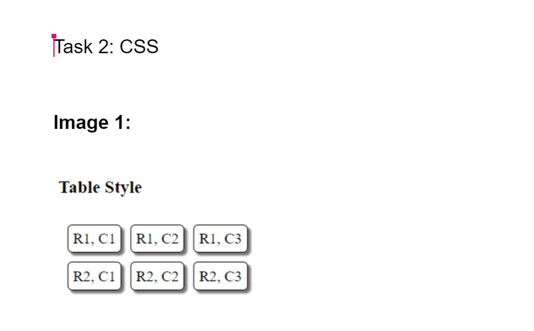

# CSS-practice

## Description

It's an exercise in (HTML & CSS) with skelton made using Html designed by CSS.

## What are the tools you used to create it? 
- GitHub
- Visual Studio Code

## Image-1 

### link-1
- [*Image-1(HTML)*](Image-1.html)
- [*Image-1(CSS)*](Image-1.css)

## Image-2

### link-2
- [*Image-2(HTML)*](Image-2.html)
- [*Image-2(CSS)*](Image-2.css)

## Image-3

### link 
- [*Image-3(HTML)*](Image-3.html)
- [*Image-3(CSS)*](Image-3.css)

# Task-2
### Challenge-Solution

### Links

- [*Sol-Challenge(HTML)*](../CSS-practice/task-2/Index.html)
- [*Sol-Challenge(CSS)*](../CSS-practice/task-2/main.css)
